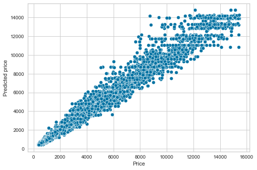
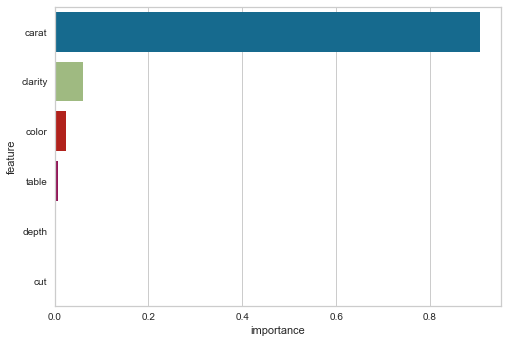

# Diamond Price Prediction

## Summary

Diamonds are described and classified based on the [four Cs](https://www.gia.edu/diamond-quality-factor): Carat, Colour, Clarity and Cut. Here we analyze diamond price using a [dataset from Kaggle](https://www.kaggle.com/shivam2503/diamonds) based on the four C’s, total depth percentage, table size, length, width and depth of 51049 diamonds. Five Machine Learning algorithms (Linear Regression, K-Nearest Neighbor, Decision Tree, Random Forest, Support Vector Machine) in combination with feature engineering (all 9 features vs. 6 selected features) were compared.

The analysis was performed using Python and included retrieving data from a CSV file, data mining, analytics, modelling and data visualization. Numpy and panda were used for data manipulation, seaborn and matplotlib for creating visualizations, and Scikit-Learn for construction and evaluation of regression models.

## Data Cleaning
The [original dataset](diamonds.csv) contained 10 features and the price for 53940 diamonds. The cleaned dataset contained 9 features for 51049 diamonds.
1. Removed irrelevant column 'Unnamed: 0'.
2. Removed duplicated rows.
3. Removed zero values in columns 'x', 'y' and 'z' (length, width and height of diamonds).
4. Discarded outliers more than 3 standard deviations away from mean.

## Data Exploration
1. Summary statistics (mean, standard deviation, mininimum, 25% quartile, 50% quartile, 75% quartile, maximum), coefficient of variation and skewness of numerical features.
2. Summary statistics (number of unique variables, mode, frequency of mode) and names of unique categorical variables.
3. Pearson correlation between numerical features.
4. Distribution of numerical features (histogram, KDE).
5. Distribution of categorical variables (category plot, violin plot, KDE plot).

## Feature engineering
Compared using all 9 features and only 6 features (all except 'x', 'y', 'z', i.e. length, width and depth of diamonds) for 5 machine learning algorithms (Linear Regression, K-Nearest Neighbor, Decision Tree, Random Forest, Support Vector Machine).

For the best two algorithms, Decision Tree and Random Forest, there was little change in root mean squared error upon removing the 3 features 'x','y' and 'z' (length, width and depth of diamonds). As removing these 3 features has the advantages of eliminating multicollinearity and reducing model complexity, we used only 6 features, i.e. all features except 'x', 'y' and 'z', when developing the final model.

## Hyperparameter optimization
Optimized the hyperparameters of the three best algorithms, Random Forest, Decision Tree and K-Nearest Neighobur, by visualizing the optimal values of selected hyperparameters then fine tuning using Random Search.

## Conclusion

Decision Tree was the most robust algorithm and provided a test root mean squared error of 506.60 and R^2 of 0.98. The price of each diamond predicted by the model deviated from the actual price by only 289.73 dollars on average.

Random Forest was the second best algorithm and provided a test root mean squared error of 556.74 and R^2 of 0.97. Feature importance analysis revealed 'carat' was by far the most importance feature for diamond price prediction. 'Clarity' and 'color' were the second and third most important features respectively.

Figure 1. The predicated price provided by the Decision Tree algorithm closely resembled the actual price.

Figure 2. Feature important analysis of the best Random Forest model revealed Carat was the most importance feature for diamond price prediction. Clarity and Color were the second and third most important features respectively.

## Resources

[diamond.ipynb](./diamond.ipynb) contains the Python codes used to construct and evaluation Random Forest, Decision Tree and K-Nearest Neighbour models for diamond price prediction.
