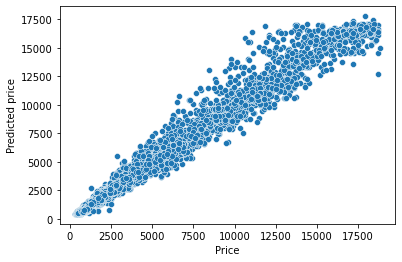

# Diamond Price Prediction

## Summary

According to [GIA's grading system](https://www.gia.edu/diamond-quality-factor), a diamond is described and classified based on the four Cs: Carat, Colour, Clarity and Cut. Here we analyze diamond price using a [dataset from Kaggle](https://www.kaggle.com/shivam2503/diamonds), which included the four C’s, in addition to depth and table size, of 53940 diamonds. The analysis includes retrieving data from a CSV file, data mining, analytics, modelling and data visualization. The analysis is based in Python and uses Numpy and panda for data manipulation, seaborn and matplotlib for creating visualizations, and Scikit-Learn for construction and evaluation of regression models.

## Conclusion

The highest accuracy was attained by the optimized Random Forest algorithm, which provided a test mean squared error of 308304.13 and R^2 of 0.98. On average, the diamond price predicted by the model deviated from the actual price by only 303.45 dollars. Feature importance analysis revealed Carat was by far the most importance feature for diamond price prediction. 

Figure 1. The predicated price provided by the Random Forest algorithm closely resembled the actual price.

Figure 2. Feature important analysis of the best Random Forest model revealed Carat was the most importance feature for diamond price prediction. Clarity and Color were the second and third most important features respectively.

## Resources

[diamond.ipynb](./diamond.ipynb) contains the Python codes used to construct and evaluation Random Forest, Decision Tree and K-Nearest Neighbour models for diamond price prediction.
